# ?? Publication and Repository Information

## ?? **GitHub Repository**

The Bot.Builder.Community.Adapters.Infobip.Messages library is part of the **Bot Builder Community** project and is hosted on GitHub:

### Repository Details
- **GitHub Organization**: [BotBuilderCommunity](https://github.com/BotBuilderCommunity)
- **Repository**: [botbuilder-community-dotnet](https://github.com/BotBuilderCommunity/botbuilder-community-dotnet)
- **Library Path**: `libraries/Bot.Builder.Community.Adapters.Infobip.Messages/`
- **License**: [MIT License](https://github.com/BotBuilderCommunity/botbuilder-community-dotnet/blob/master/LICENSE)

### Repository Structure
```
BotBuilderCommunity/botbuilder-community-dotnet/
??? libraries/
?   ??? Bot.Builder.Community.Adapters.Infobip.Messages/
?       ??? Bot.Builder.Community.Adapters.Infobip.Messages.csproj
?       ??? README.md
?       ??? TESTING.md
?       ??? InfobipMessagesAdapter.cs
?       ??? InfobipMessagesAdapterOptions.cs
?       ??? Models/
?       ??? ToInfobip/
?       ??? ToActivity/
??? tests/
?   ??? Bot.Builder.Community.Adapters.Infobip.Messages.Tests/
??? samples/
    ??? (Sample projects for other adapters)
```

## ?? **NuGet Publication Process**

### Current Build and Publication Status

| Component | Status | Details |
|-----------|--------|---------|
| **Build System** | ? Azure DevOps | [Build Pipeline](https://dev.azure.com/BotBuilder-Community/dotnet/_build/latest?definitionId=1&branchName=master) |
| **CI/CD** | ? Automated | Builds triggered on main branch commits |
| **NuGet Publication** | ? Automated | Published to NuGet.org on release |
| **Preview Builds** | ? MyGet Feed | Available for testing pre-release versions |

### Build Status Badges

The current build status is tracked via Azure DevOps:

```markdown
[](https://dev.azure.com/BotBuilder-Community/dotnet/_build/latest?definitionId=1&branchName=master)
```

### NuGet Package Information

#### Production Package (NuGet.org)
- **Package Name**: `Bot.Builder.Community.Adapters.Infobip.Messages`
- **NuGet URL**: https://www.nuget.org/packages/Bot.Builder.Community.Adapters.Infobip.Messages/
- **Current Version**: `1.0.0` (stable)
- **Installation Command**: 
  ```bash
  dotnet add package Bot.Builder.Community.Adapters.Infobip.Messages
  ```

#### Preview Package (MyGet Feed)
- **Feed URL**: https://www.myget.org/feed/botbuilder-community-dotnet/package/nuget/Bot.Builder.Community.Adapters.Infobip.Messages
- **Preview Versions**: Available for testing latest changes
- **Installation Command**:
  ```bash
  # Add MyGet source first
  dotnet nuget add source https://www.myget.org/F/botbuilder-community-dotnet/api/v3/index.json -n botbuilder-community
  
  # Install preview version
  dotnet add package Bot.Builder.Community.Adapters.Infobip.Messages --version 1.0.0-preview
  ```

## ?? **Publication Workflow**

### 1. Development Process

```mermaid
graph LR
    A[Fork Repository] --> B[Create Feature Branch]
    B --> C[Implement Changes]
    C --> D[Write Tests]
    D --> E[Update Documentation]
    E --> F[Create Pull Request]
    F --> G[Code Review]
    G --> H[Merge to Master]
    H --> I[Automated Build]
    I --> J[Publish to MyGet]
    J --> K[Release Process]
    K --> L[Publish to NuGet]
```



### 2. Automated Build Process

When code is committed to the master branch:

1. **Azure DevOps Pipeline** triggers automatically
2. **Multi-target build** (.NET Standard 2.0, .NET Core 3.1)
3. **Unit tests** are executed
4. **Code analysis** and quality checks
5. **Package creation** with version incrementing
6. **MyGet publication** for preview testing
7. **Artifacts** stored for release process

### 3. Release Process

For stable releases:

1. **Tag creation** with semantic versioning (e.g., `v1.0.0`)
2. **Release notes** generation
3. **Final testing** of release candidate
4. **NuGet.org publication** with stable version
5. **GitHub release** with binaries and documentation
6. **Announcement** to community

## ??? **Build Configuration**

### Project Configuration

The project uses shared build targets from the Bot Builder Community:

```xml
<Project Sdk="Microsoft.NET.Sdk">
  <Import Project="$([MSBuild]::GetDirectoryNameOfFileAbove('$(MSBuildThisFileDirectory)../', 'Bot.Builder.Community.sln'))\CommonTargets\library.shared.targets" />

  <PropertyGroup>
    <TargetFramework>netstandard2.0</TargetFramework>
    <Description>Adapter for v4 of the Bot Builder .NET SDK for connecting bots with Infobip Messages API for multiple communication channels.</Description>
    <PackageProjectUrl>https://github.com/BotBuilderCommunity/botbuilder-community-dotnet/tree/master/libraries/Bot.Builder.Community.Adapters.Infobip.Messages</PackageProjectUrl>
    <RepositoryUrl>http://www.github.com/botbuildercommunity/botbuildercommunity-dotnet</RepositoryUrl>
    <PackageTags>microsoft;bot;adapter;infobip;messages;whatsapp;sms;viber;line;botframework;botbuilder;bots</PackageTags>
  </PropertyGroup>
</Project>
```

### Shared Build Properties

Common properties are inherited from `library.shared.targets`:
- **Version Management**: Semantic versioning
- **Assembly Information**: Company, copyright, etc.
- **Code Analysis**: StyleCop, FxCop rules
- **Documentation**: XML doc generation
- **Source Link**: GitHub source linking
- **Packaging**: NuGet metadata

## ?? **Version History**

### Planned Versioning Strategy

| Version | Status | Features | Release Date |
|---------|--------|----------|--------------|
| `1.0.0-preview1` | ?? Development | Basic messaging, webhook handling | TBD |
| `1.0.0-preview2` | ?? Planned | Interactive messaging, templates | TBD |
| `1.0.0-preview3` | ?? Planned | Advanced features, sample project | TBD |
| `1.0.0` | ?? Planned | Stable release, full documentation | TBD |
| `1.1.0` | ?? Future | Enhanced interactivity, more channels | TBD |

### Current Status

- **Core Implementation**: ? Complete
- **Basic Testing**: ? Complete  
- **Advanced Features**: ?? In Progress
- **Sample Project**: ? Not Started
- **Documentation**: ? Complete
- **Production Testing**: ? Needed

## ?? **Contributing to Publication**

### How to Contribute

1. **Fork the repository** on GitHub
2. **Create feature branch** from master
3. **Implement your changes** following coding standards
4. **Add unit tests** for new functionality
5. **Update documentation** as needed
6. **Submit pull request** with detailed description

### Code Standards

- **C# 7.3** language features (compatible with .NET Standard 2.0)
- **StyleCop** rules enforcement
- **Unit test coverage** for all public APIs
- **XML documentation** for all public members
- **Async/await patterns** for all I/O operations

### Testing Requirements

Before submitting PR:
- ? All existing tests pass
- ? New tests for added functionality
- ? Integration tests with Bot Framework Emulator
- ? Manual testing with real Infobip account (if possible)

## ?? **Publication Announcements**

### Where Releases Are Announced

1. **GitHub Releases**: https://github.com/BotBuilderCommunity/botbuilder-community-dotnet/releases
2. **NuGet.org**: Package page updates automatically
3. **Bot Builder Community Blog**: Major release announcements
4. **Microsoft Bot Framework Community**: Via GitHub discussions

### Release Notes Format

Each release includes:
- **What's New**: New features and capabilities
- **Breaking Changes**: API changes requiring code updates
- **Bug Fixes**: Issues resolved in this version
- **Known Issues**: Current limitations
- **Migration Guide**: How to upgrade from previous version

## ?? **Package Verification**

### Verify Package Authenticity

When installing from NuGet:

```bash
# Verify package signature
dotnet nuget verify Bot.Builder.Community.Adapters.Infobip.Messages

# Check package metadata
dotnet list package --include-transitive | grep Infobip
```

### Security and Trust

- **Signed packages**: All releases are signed by Bot Builder Community
- **Security scanning**: Automated vulnerability scanning in CI/CD
- **Dependency tracking**: Regular updates for security patches
- **Code transparency**: Full source code available on GitHub

## ?? **Support and Issues**

### Where to Get Help

1. **GitHub Issues**: https://github.com/BotBuilderCommunity/botbuilder-community-dotnet/issues
2. **Discussions**: https://github.com/BotBuilderCommunity/botbuilder-community-dotnet/discussions
3. **Stack Overflow**: Tag with `botbuilder-community` and `infobip`
4. **Bot Framework Community**: Microsoft Bot Framework community forums

### Reporting Issues

When reporting issues:
- ? Use issue templates
- ? Provide minimal reproduction steps
- ? Include version information
- ? Add relevant logs (remove sensitive data)
- ? Specify Infobip account type (if applicable)

---

This publication process ensures high-quality, reliable packages for the Bot Builder community while maintaining transparency and community involvement.